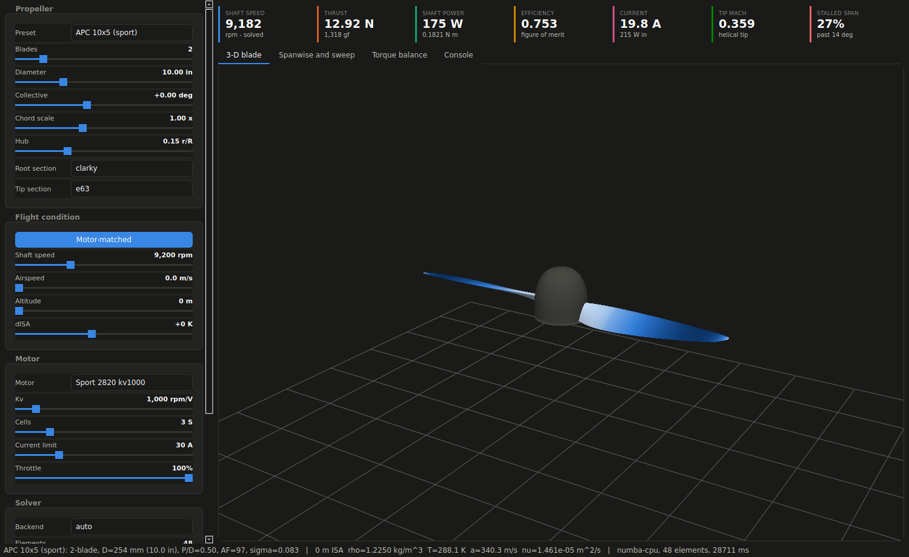
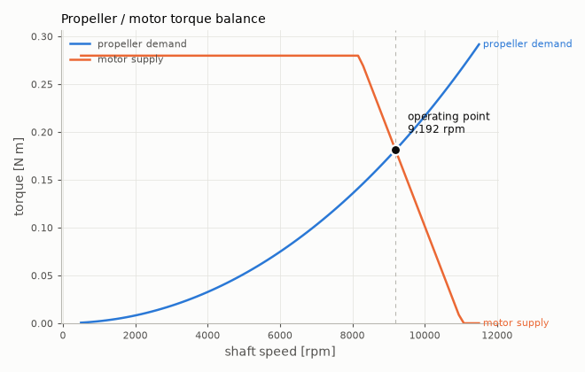
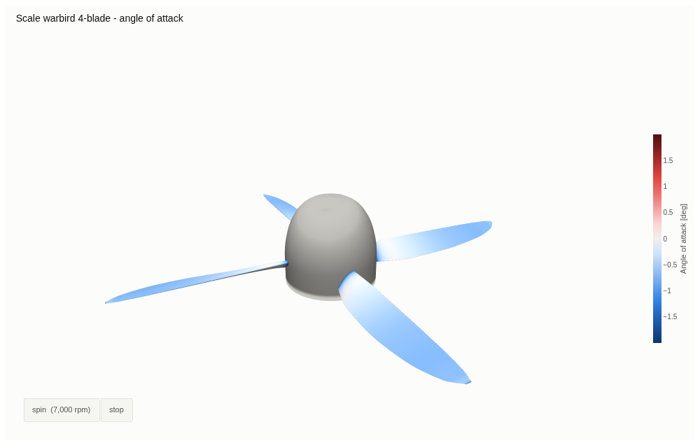
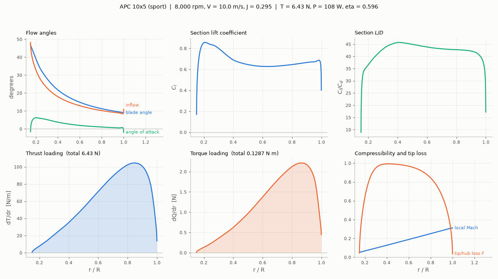
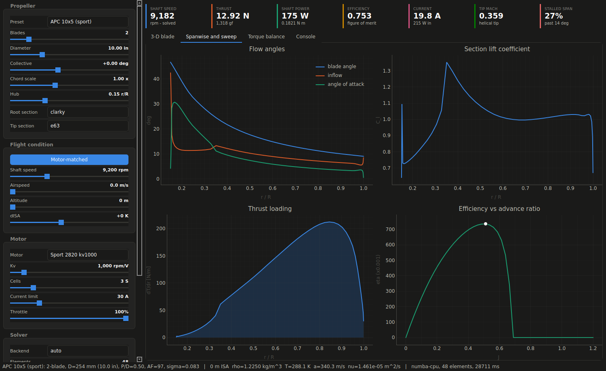

# Propwash

[](https://colab.research.google.com/github/abu-infidel/collab-test-/blob/main/notebooks/Propwash_Propeller_Lab.ipynb)

**A GPU-accelerated blade-element-momentum propeller laboratory with a 3-D visualiser.**

Change a propeller — pitch, diameter, blade count, aerofoil, air density, motor —
and Propwash tells you the two things you actually want to know: **how fast it
ends up spinning**, and **how much thrust it makes**. The 3-D blade is coloured
by whichever solver field you choose and spins at a rate proportional to the
solved RPM, so the coupling between the two is something you watch rather than
something you read off a table.

Built to run on a Google Colab GPU runtime, and to degrade gracefully to a plain
CPU one.



---

## Why shaft speed is an *output*

A propeller has no RPM of its own. It has a torque demand that rises roughly as
RPM², and a motor has a torque supply that falls towards its no-load speed.
Where the two cross is where the thing runs.



Coarsen the pitch and the crossing moves left: the propeller *slows down*, makes
more thrust, and pulls more current. Every control in the GUI is really just
moving that crossing. Holding everything else fixed on an APC 10×5 with a 1000 kv
motor on 3S:

| change | shaft speed | thrust | current |
|---|---:|---:|---:|
| baseline | 9,193 rpm | 12.88 N | 19.7 A |
| collective +4° | 8,695 rpm | 14.14 N | 24.8 A |
| collective −4° | 9,701 rpm | 10.76 N | 14.4 A |
| 3 blades | 8,633 rpm | 15.07 N | 25.4 A |
| 12 in diameter | 7,242 rpm | 16.63 N | 30.0 A |
| 4S pack | 11,283 rpm | 19.87 N | 30.0 A |
| 4 km altitude | 9,672 rpm | 9.45 N | 14.7 A |
| 15 m/s forward | 9,373 rpm | 7.28 N | 17.8 A |

---

## Quick start

### On Colab (the intended home)

Pick *Runtime → Change runtime type → T4 GPU*, then:

```python
!git clone https://github.com/abu-infidel/collab-test- propwash-repo
%cd propwash-repo

import propwash.colab as pc
pc.setup()          # installs only what is missing; prints what this host can do
lab = pc.launch()   # the GUI
```

Or open [`notebooks/Propwash_Propeller_Lab.ipynb`](notebooks/Propwash_Propeller_Lab.ipynb),
which walks through the physics, the charts, the CUDA kernel and a benchmark of
the host you happen to be on.



### Locally

```bash
pip install -e ".[all]"     # or: pip install -e ".[notebook]" for the notebook only

python -m propwash gui                     # desktop GUI (Qt + OpenGL)
python -m propwash env                     # what can this machine do?
python -m propwash solve --rpm 9000 --speed 12
python -m propwash match --motor "Sport 2820 kv1000"
python -m propwash bench --cases 16384     # benchmark and cross-validate backends
python -m propwash cuda-check              # compile the CUDA C with NVRTC, no GPU
```

### As a library

```python
from propwash import get_preset, OperatingPoint, PropellerSolver

prop = get_preset("APC 10x5 (sport)")
result = PropellerSolver(prop).solve(OperatingPoint(rpm=9000, v_inf=12.0))
print(result.summary())          # thrust, power, CT, CP, eta, tip Mach, ...
print(result.alpha, result.dt_dr)  # and the full spanwise state
```

---

## The physics

BEMT reconciles two descriptions of the same blade element: the **blade-element**
view (a little wing with a lift and a drag) and the **momentum** view (an annulus
of an actuator disk accelerating air). They agree at exactly one inflow angle φ.

Propwash solves for φ directly, as the root of

```
R(φ) = Ω·r·(4F·sin²φ − σ·Cn) − V·(σ·Ct + 4F·sinφ·cosφ)
```

where `σ = Bc/2πr` is the local solidity and `F` is the Prandtl tip/hub loss.
This form was not chosen for elegance. It was chosen because:

- **It has no division.** The usual `a = k/(1−k)` induction-factor formulation
  blows up as `k → 1` and is undefined at `V = 0`.
- **It is finite at V = 0.** Static thrust is the first case anyone looks at, and
  here the residual collapses to `4F·sin²φ = σ·Cn`, which is simply correct.
- **It provably brackets.** `R(0⁺) < 0` and `R(π/2⁻) > 0` in the propeller state,
  so bisection converges unconditionally — no initial guess, no relaxation
  factor, no divergence.
- **It suits a GPU.** Fixed iteration count, no early exit, no data-dependent
  branching: every thread in a warp executes the identical instruction stream.

Newton would be faster on a CPU and far worse on a GPU. That trade is the reason
this program is shaped the way it is. The full derivation is in
[`docs/PHYSICS.md`](docs/PHYSICS.md).

### What is modelled

| | |
|---|---|
| Sections | Parametrised polars blended into Viterna–Corrigan deep stall, defined over the full ±180°. Nine presets; XFOIL/AirfoilTools files load directly. |
| Corrections | Prandtl tip and hub loss, Reynolds-number drag and Cl_max scaling, Prandtl–Glauert compressibility, Lock wave-drag rise past drag divergence. |
| Atmosphere | ISA 0–32 km, Sutherland viscosity, ΔISA offsets, humidity, density altitude. |
| Geometry | Parametric chord/twist/thickness/sweep/dihedral with a monotone PCHIP option; ten propeller presets with APC-style planforms. |
| Propulsion | First-order brushless DC motor with ESC current limit, and the torque-balance solve that gives shaft speed. |



---

## The CUDA side

Two GPU implementations, deliberately different in kind:

- **Numba CUDA** — compiled from the *same scalar Python functions* as the CPU
  kernel. `propwash/accel/kernels.py` rebuilds each function object against a
  namespace where its dependencies are already compiled for the target, so the
  CPU and GPU paths share bytecode and cannot silently drift apart.
- **Raw CUDA C** (`propwash/accel/kernels_raw.py`) — hand written, compiled by
  CuPy's NVRTC bridge at runtime. This is the one you can read as CUDA, profile
  with Nsight, and tune the block size of.

Both use **one block per operating point**, threads striding over blade stations,
and a shared-memory tree reduction for thrust and torque. Blade stations are
exactly the values that must be summed, so the reduction is block-local and needs
no global atomics.

Backends are probed once and selected automatically — `cupy` → `numba-cuda` →
`torch` → `numba-cpu` → `numpy`. A missing backend reports *why* and the next one
down is used; nothing here fails because a GPU is absent.

```
$ python -m propwash env
  cupy         [unavailable] ModuleNotFoundError: No module named 'cupy'
  numba-cuda   [unavailable] no CUDA device visible to Numba
  torch        [unavailable] ModuleNotFoundError: No module named 'torch'
  numba-cpu    [ok] Numba 0.67.0, 4 threads
  numpy        [ok] NumPy 2.4.6, vectorised reference path
  -> selected   numba-cpu
```

You can compile-check the CUDA C **without a GPU at all** — NVRTC is a compiler,
not a runtime:

```
$ pip install nvidia-cuda-nvrtc-cu12
$ python -m propwash cuda-check
compute_75     OK      PTX  168,589 bytes
compute_80     OK      PTX  168,589 bytes
compute_89     OK      PTX  168,589 bytes
```

---

## Validation

Speed without correctness is not a feature, so the two are reported together and
tested together.

- Every backend is diffed against the NumPy reference on the same grid, by the
  test suite and by `propwash bench`. Agreement is to ~1e-14 relative.
- The scalar device functions match the vectorised solver to **8e-16 rad** in
  inflow angle.
- The CUDA kernel is executed under `NUMBA_ENABLE_CUDASIM` in CI, exercising the
  shared-memory reduction and the block-per-case mapping without a GPU.
- The raw CUDA C is compiled to PTX by NVRTC for compute_75 through compute_90.
- The PyTorch path is forced onto the CPU in the suite so it is covered even
  where `TorchBackend` correctly reports itself unavailable.
- The ISA implementation reproduces the published standard-atmosphere table
  exactly (11 km → 22632 Pa, 0.36392 kg/m³).
- Physical invariants are asserted, not assumed: figure of merit stays below 1,
  static thrust stays under the ideal actuator-disk limit, efficiency peaks in
  the interior and never exceeds unity, thrust loading collapses at the tip.

Against published static data for an APC 10×5 the model lands within roughly
**10%, under-predicting** — the normal direction and magnitude for BEMT.

```
$ python -m pytest -q
166 passed
```

The full derivation, every correction, and an explicit list of what the model
does *not* do are in [`docs/PHYSICS.md`](docs/PHYSICS.md).

---

## Known limits

Stated plainly, because a tool that hides its assumptions is worse than one that
is merely approximate.

- **Only the normal thrusting branch is bracketed.** Windmilling and
  propeller-brake states have their root outside (0, π/2). Those elements are
  reported as non-converged rather than returned as plausible-looking nonsense,
  and both GUIs surface it in the status line.
- **The bundled polars are models, not measurements.** They are parametrised
  fits to published section characteristics. For serious work load real polars
  with `propwash.airfoil.load_polar_file`.
- **Deep post-stall is Viterna–Corrigan**, which exists to keep the solver
  convergent through angles no propeller sees in normal operation — not to be
  accurate at 60° angle of attack.
- **Strip theory.** No radial flow, no hub/spinner blockage, no blade flex, no
  unsteadiness, no non-axial inflow. Rotational stall delay is implemented but
  off by default.
- **`figure_of_merit` is a hover metric** and `efficiency` a forward-flight one;
  each is reported as zero where it stops meaning anything, rather than as a
  spike.

---

## Layout

```
propwash/
  atmosphere.py     ISA, Sutherland viscosity, density altitude
  airfoil.py        polars, Viterna extrapolation, Re/Mach corrections
  geometry.py       parametric blade distributions and presets
  motor.py          brushless DC model and the torque-balance solve
  bemt/
    core.py         the residual, the bisection, the result container
    solver.py       cached high-level API
    sweep.py        1-D and 2-D parameter maps, coupled solves
  accel/
    _device_math.py the scalar physics, written once
    kernels.py      Numba CPU and CUDA kernels compiled from it
    kernels_raw.py  hand-written CUDA C for CuPy
    torch_path.py   PyTorch path (CUDA or Metal)
    backend.py      probing, selection, graceful degradation
    bench.py        benchmark + cross-validation
    nvrtc.py        compile the CUDA C without a GPU
  mesh/             NACA sections, blade lofting, OBJ/STL export
  viz/              colour tokens, Matplotlib figures, Plotly 3-D
  gui/              Qt desktop app
  colab/            environment bootstrap and the ipywidgets app
  cli.py            command line
```



---

## Requirements

NumPy is the only hard dependency. Everything else is optional and degrades
cleanly:

| extra | brings | for |
|---|---|---|
| `accel` | numba | multi-core CPU and CUDA kernels |
| `cuda` | numba, cupy-cuda12x | the raw CUDA C path |
| `torch` | torch | GPU path on CUDA or Apple Metal |
| `notebook` | plotly, ipywidgets, pandas, matplotlib | the Colab GUI |
| `desktop` | PySide6, pyqtgraph, PyOpenGL | the Qt GUI |
| `dev` | pytest, nvidia-cuda-nvrtc-cu12 | tests and the GPU-free CUDA check |

## Licence

MIT.
