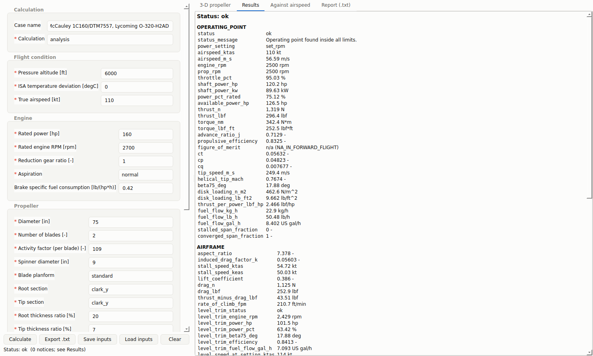
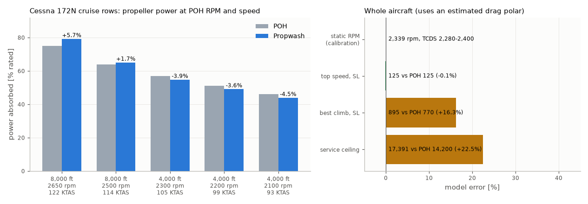

# Propwash

[](https://colab.research.google.com/github/abu-infidel/Python-based-BEMT-visualizer-calculator/blob/main/notebooks/Propwash_Propeller_Lab.ipynb)

**A propeller calculator for full-size aircraft.** Describe a propeller, a
piston engine and a flight condition, and Propwash works out where the
propeller actually runs: its RPM (or its blade angle, for constant speed),
thrust, power, efficiency and fuel flow. Add an airframe and it also gives
drag, level-flight trim, top speed, best climb and ceilings. It can also
**size** a propeller for a cruise point. Results are saved, when you ask, as a
structured `.txt` report that other programs can read.

- **No defaults.** Every input starts empty. Required fields are marked, and a
  missing one is reported, never silently filled in.
- **No caps.** Inputs are free text, so 1,500 hp, 156-inch propellers and
  30,000 ft are all accepted. Unusual values produce a warning, not a refusal.
- **No silent zeros.** A result that cannot exist (power not available at
  altitude, a propeller that would over-rev, a windmilling blade) comes back
  with a status and a reason code instead of a zero or an invented number.
- **Checked against a real aircraft.** Against the Cessna 172N's published data,
  propeller power agrees with five POH cruise rows within 6% and top speed
  within 0.1%. Static RPM is inside the type-certificate range.
  Climb and ceiling are over-predicted by 16–22%. All of this is laid out in
  [docs/VALIDATION.md](docs/VALIDATION.md), including the two quantities that
  were calibrated.
- **GPU optional.** Big parameter sweeps run on CUDA, OpenCL or PyTorch when
  available. Everything also works on a plain CPU.



> **2.0 is full-size only.** The drone and electric-motor version, with its
> presets, is preserved unchanged on the
> [`legacy/drone-and-aircraft`](https://github.com/abu-infidel/Python-based-BEMT-visualizer-calculator/tree/legacy/drone-and-aircraft)
> branch.

---

## Quick start

### On Colab

```python
!git clone --depth 1 https://github.com/abu-infidel/Python-based-BEMT-visualizer-calculator.git /content/propwash
%cd /content/propwash

import propwash.colab as pc
pc.setup()          # installs only what is missing; prints what this host can do
app = pc.launch()   # the form: fill it in, press Calculate, then Export .txt
```

[docs/COLAB.md](docs/COLAB.md) walks through the form and the GPU runtime, and
covers what to do if the app renders as a blank cell.

### Locally

```bash
git clone https://github.com/abu-infidel/Python-based-BEMT-visualizer-calculator.git
cd Python-based-BEMT-visualizer-calculator
pip install -e ".[all]"      # or ".[desktop]" / ".[notebook]"

python -m propwash gui                          # desktop app (Qt)
python -m propwash template -o case.json        # a blank case file, every field null
python -m propwash fields                       # what each field means, with units
python -m propwash run case.json -o report.txt  # calculate and save the report
python -m propwash parse report.txt --json      # read a report back as JSON
python -m propwash validate                     # the Cessna 172N comparison
```

### As a library

```python
from propwash import blank_case, run

case = blank_case("analysis")          # every field None
case.update({
    "flight.altitude_ft": 6000, "flight.isa_deviation_c": 0, "flight.airspeed_ktas": 110,
    "engine.rated_power_hp": 160, "engine.rated_rpm": 2700, "engine.gear_ratio": 1,
    "engine.aspiration": "normal",
    "propeller.diameter_in": 75, "propeller.blades": 2, "propeller.activity_factor": 109,
    "propeller.spinner_diameter_in": 9, "propeller.planform": "standard",
    "propeller.root_airfoil": "clark_y", "propeller.tip_airfoil": "clark_y",
    "propeller.root_thickness_pct": 20, "propeller.tip_thickness_pct": 7,
    "propeller.pitch_type": "fixed", "propeller.pitch_in": 57,
    "operating.mode": "set_rpm", "operating.engine_rpm": 2500,
})
report = run(case)                     # never raises on bad input
print(report.status, report.get("OPERATING_POINT", "shaft_power_hp"))
report.save("report.txt")
```

---

## Inputs

| group | fields |
|---|---|
| Calculation | `analysis` or `sizing`; an optional case name |
| Flight condition | pressure altitude, ISA deviation, true airspeed (0 = static) |
| Engine | rated power and RPM (the RPM is also the limit), gear ratio, normal or turbocharged (plus critical altitude); optional BSFC |
| Propeller | diameter, blades, activity factor, spinner diameter, planform, root and tip section and thickness, fixed pitch (its pitch) or constant speed (fine and coarse stops) |
| Power setting | full throttle, set RPM (fixed pitch) or set power, with the RPM and power they need |
| Airframe (optional, all or nothing) | weight, wing area, span, CD0, Oswald *e*, CLmax |
| Sizing | maximum diameter, tip Mach limit, design lift coefficient, section |

`python -m propwash fields` prints every field with its unit, its meaning and
the range usual for full-size aircraft.

## Outputs: the `.txt` report

**Export .txt** in either app, or `propwash run ... -o`, writes a report like
[this one](docs/report-format/example_analysis.txt):

```
#PROPWASH-REPORT 1
[OPERATING_POINT]
status = "ok"
engine_rpm = 2500 [rpm]
shaft_power_hp = 120.2 [hp]
thrust_lbf = 296.424 [lbf]
propulsive_efficiency = 0.83246 [-]
figure_of_merit = null [-] {NA_IN_FORWARD_FLIGHT}
...
[TABLE.SPEED_SWEEP]
airspeed_ktas[kt],status[],engine_rpm[rpm],throttle_pct[%],...
```

Every value is a JSON scalar with a unit. Every `null` carries a reason code,
tables are CSV, and the file ends with a SHA-256 checksum.
**[docs/report-format/README.md](docs/report-format/README.md)** is the full
specification, written for developers and LLM tools that need to read these
files. It documents every section, key, unit, status and code, gives a
reference parser and a 15-line standalone one, and states the versioning rules.

---

## The physics, briefly

Blade-element momentum theory with Prandtl tip and hub loss, solved for each
blade station as a single residual in the inflow angle by fixed-iteration
bisection (GPU-friendly, guaranteed to converge). Corrections specific to
full-size blades:

- section data at Re = 3 million with thickness effects on drag and maximum lift;
- Reynolds scaling of drag;
- Prandtl–Glauert lift with a Mach-dependent lift ceiling;
- Korn–Lock wave drag;
- Viterna–Corrigan post-stall.

The engine model uses a torque curve and the Gagg–Farrar altitude lapse, with a
turbocharger option. Matching is vectorised over airspeed and reports the
status of every point. Sizing designs an Adkins–Liebeck minimum-induced-loss
blade at every candidate diameter and checks the winner with the independent
BEMT solver. The derivation and the full list of limits are in
**[docs/PHYSICS.md](docs/PHYSICS.md)**.



---

## GPU acceleration, with or without CUDA

CUDA only runs on NVIDIA hardware with the toolkit installed. **OpenCL** runs on
AMD and Intel GPUs, on Apple silicon, and — through POCL or Intel's CPU runtime
— on a plain CPU, which is also what makes it testable without a GPU at all.

The OpenCL and CUDA kernels are **the same C source**. They differ only in
qualifiers and in how they name the block and thread index, so
`propwash/accel/kernels_raw.py` holds one template and renders both:
`kernel_source("cuda")` returns real CUDA C, `kernel_source("opencl")` returns
real OpenCL C. Keeping two copies would mean the physics drifts, and a drift
between a CUDA path and an OpenCL path is close to undebuggable — you would need
both kinds of hardware in front of you to notice.

Two further implementations, deliberately different in kind:

- **Numba CUDA** — compiled from the *same scalar Python functions* as the CPU
  kernel. `propwash/accel/kernels.py` rebuilds each function object against a
  namespace where its dependencies are already compiled for the target, so the
  CPU and GPU paths share bytecode and cannot silently drift apart.
- **Raw CUDA C** (`propwash/accel/kernels_raw.py`) — hand written, compiled by
  CuPy's NVRTC bridge at runtime. This is the one you can read as CUDA, profile
  with Nsight, and tune the block size of.

Both use **one block per operating point**, threads striding over blade stations,
and a shared-memory tree reduction for thrust and torque. Blade stations are
exactly the values that must be summed, so the reduction is block-local and needs
no global atomics.

Backends are probed once and selected automatically — `cupy` → `numba-cuda` →
`opencl` → `torch` → `numba-cpu` → `numpy`. OpenCL's rank is device-aware: above
the CPU paths on a real GPU, below them when it is running on a CPU runtime,
where it is a correctness win rather than a speed one. A missing backend reports
*why* and the next one down is used; nothing here fails because a GPU is absent.

```
$ python -m propwash env
  cupy         [unavailable] ModuleNotFoundError: No module named 'cupy'
  numba-cuda   [unavailable] no CUDA device visible to Numba
  torch        [unavailable] ModuleNotFoundError: No module named 'torch'
  numba-cpu    [ok] Numba 0.67.0, 4 threads
  numpy        [ok] NumPy 2.4.6, vectorised reference path
  -> selected   numba-cpu
```

You can compile-check the CUDA C **without a GPU at all** — NVRTC is a compiler,
not a runtime:

```
$ pip install nvidia-cuda-nvrtc-cu12
$ python -m propwash cuda-check
compute_75     OK      PTX  168,589 bytes
compute_80     OK      PTX  168,589 bytes
compute_89     OK      PTX  168,589 bytes
```

---

## Known limits

- Full-size aircraft only (light aircraft and up). For drones and models, use
  the `legacy/drone-and-aircraft` branch.
- Climb and ceiling come out 16–22% high on the C172N. Installation losses
  (slipstream scrubbing and cooling drag) are not modelled, and the drag polar
  is your input.
- Strip theory: no radial flow, no spinner blockage, no unsteady or non-axial
  inflow. Blades built from a pitch have helical twist.
- The bundled section polars are fitted models. For real work, load measured
  polars with `propwash.airfoil.load_polar_file`.
- The engine torque curve is generic. It is good near rated RPM and only a
  guide far below it.

---

## Layout

```
propwash/
  case.py           input fields, validation (no defaults, no caps)
  analysis.py       case -> report: operating point, airframe, sweeps, sizing
  report.py         the .txt report writer and reader (docs/report-format/)
  validation.py     Cessna 172N comparison (docs/VALIDATION.md)
  matching.py       propeller/engine matching, vectorised, with statuses
  engine.py         piston engine: torque curve, altitude lapse, turbocharging
  sizing.py         diameter trade and Adkins-Liebeck minimum-induced-loss design
  geometry.py       full-size blades from diameter/AF/pitch/planform
  airfoil.py        section library, thickness/Re/Mach corrections, Viterna
  atmosphere.py     ISA with temperature offset
  bemt/             the residual, the batched solver, sweeps and maps
  accel/            Numba, CUDA C / OpenCL C, PyTorch backends, benchmark
  mesh/, viz/       3-D blade lofting, Plotly and Matplotlib figures
  gui/, colab/      the desktop and notebook apps (the same form)
  cli.py            command line
```

---

## Requirements

NumPy is the only hard dependency. Everything else is optional and degrades
cleanly:

| extra | brings | for |
|---|---|---|
| `accel` | numba | multi-core CPU and CUDA kernels |
| `cuda` | numba, cupy-cuda12x | the raw CUDA C path |
| `opencl` | pyopencl | GPU acceleration without CUDA |
| `torch` | torch | GPU path on CUDA or Apple Metal |
| `notebook` | plotly, ipywidgets, pandas, matplotlib | the Colab GUI |
| `desktop` | PySide6, pyqtgraph, PyOpenGL | the Qt GUI |
| `dev` | pytest, nvidia-cuda-nvrtc-cu12 | tests and the GPU-free CUDA check |

## Contributors

See [CONTRIBUTORS.md](CONTRIBUTORS.md). The implementation was written by
Claude via Claude Code, under the project owner's direction; that file also
records what was verified by running it and what was not.

## Licence

MIT.
